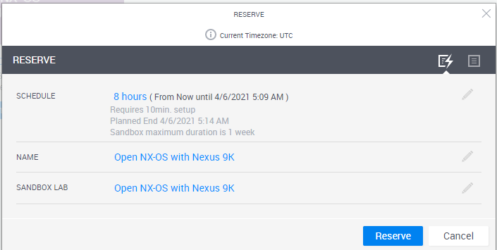
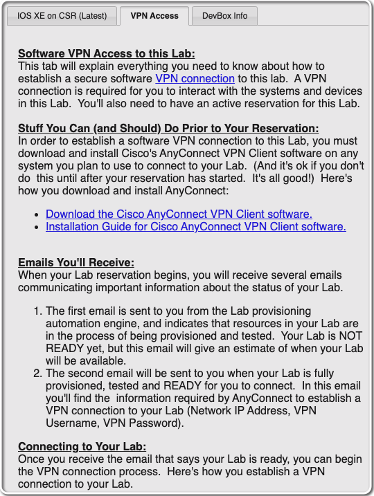
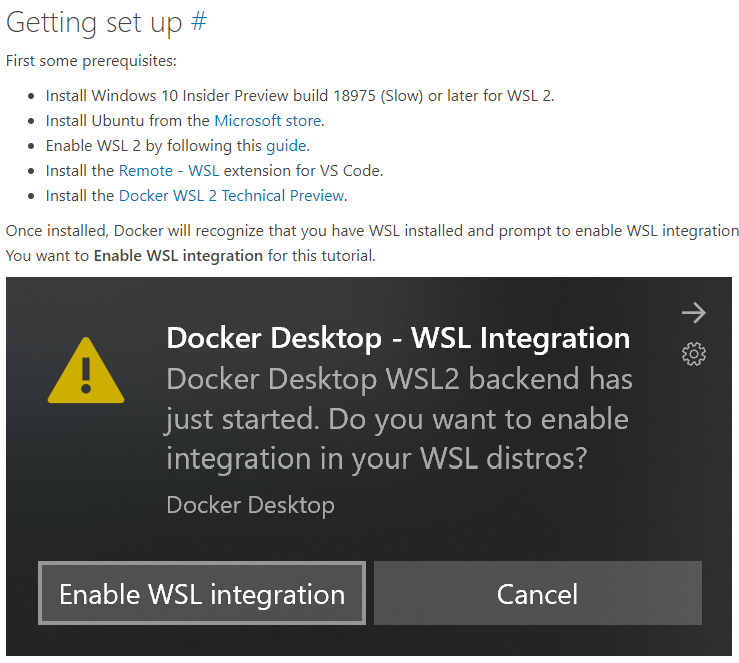

# Merlin Docker on a Cisco DevNet Sandbox Nexus 9000

For the main Merlin project and what Merlin does please visit:

[Merlin - Network Magic](https://github.com/automateyournetwork/merlin)

You can now run Merlin against a Nexus 9000 in the Cisco DevNet Sandbox.  We have included a custom script and pre-configured testbed file for this purpose.

>To get started, sign up for a Cisco DevNet account at: [DevNet Sandbox](https://devnetsandbox.cisco.com/RM/Topology)

>Once you are signed in, search for "Nexus" in the search dialog at the top left of the screen.


>Select one of the reserved instances - We recommend using the instance running the latest version of NXOS.


>Click "Reserve" after reviewing the reservation details.



You will receive an email from Cisco confirming the reservation along with links to download the Cisco AnyConnect VPN Client and instructions for its installation.

**Cisco AnyConnect VPN Client:**

[AnyConnect VPN Client](https://developer.cisco.com/site/sandbox/anyconnect/)

**Installation guide for Cisco AnyConnect VPN Client:**

[AnyConnect PDF](https://devnetsandbox.cisco.com/Docs/VPN_Access/AnyConnect_Installation_Guide.pdf)

>Click the "VPN Access" tab in the DevNet console and review the information in it.



**Note:** If this is your first time using the Cisco DevNet Sandbox, make sure to review the information in each of the tabs.

In about 15 to 20 minutes, you should receive another email from Cisco with the VPN credentials for your sandbox, including:

* VPN address and port for the connection
* VPN username
* VPN password

>Connect to the DevNet Sandbox VPN using the Cisco AnyConnect VPN Client


Once connected, you will have direct network access to the Nexus 9000 in DevNet.

The "NXOS on Nexus 9k" tab in the DevNet console will show you the details you need to connect to the device, however we have already added this information to the `testbed/testbed_DevNet_Nexus9k_Sandbox.yaml` file.

You can confirm it to be sure.


You're now ready to run Merlin against the DevNet Nexus 9000!

* To transform at least 16 common commands run the following pyATS job as a Docker Container:

# WSL2, Ubuntu, and Docker Desktop

1. Follow these instructions 

[Docker Desktop using WSL2](https://code.visualstudio.com/blogs/2020/03/02/docker-in-wsl2)



[Docker with WSL2 Backend](https://docs.docker.com/docker-for-windows/wsl/)


2. After you have WSL2, Ubuntu, and Docker Desktop installed you can proceed with cloning the repository 

``` console

git clone https://github.com/automateyournetwork/merlin_kubernetes.git

```

3. First, bring up the Homepage

``` console

kubectl apply -f kubernetes-homepage-deployment.yaml,kubernetes-homepage-service.yaml

```


Confirm the Deployment

``` console

kubectl get deployments

```


Confirm the Service

``` console

kubectl get services

```


Confirm the Pod

``` console

kubectl get pods

```


In Visual Studio Code, with the Kubernetes Extension installed and enabled, explore your Kubernetes Cluster


You can also visit http://localhost:30000 now to see the homepage as a Kubernetes microservice 

Now apply the rest of the Microservices Deployments and Services manifest files.

``` console

kubectl apply -f vrf-deployment.yaml, vrf-service.yaml

```

If you want, you can load all of the files with the following command

``` console

kubectl apply -f bgp-process-vrf-all-deployment.yaml,bgp-process-vrf-all-service.yaml,bgp-sessions-deployment.yaml,bgp-sessions-service.yaml,interface-status-deployment.yaml,interface-status-service.yaml,inventory-deployment.yaml,inventory-service.yaml,ip-int-brief-deployment.yaml,ip-int-brief-service.yaml,ip-ospf-deployment.yaml,ip-ospf-service.yaml,ip-route-deployment.yaml,ip-route-service.yaml,learned-acl-deployment.yaml,learned-acl-service.yaml,learned-arp-deployment.yaml,learned-arp-service.yaml,learned-bgp-deployment.yaml,learned-bgp-service.yaml,learned-config-deployment.yaml,learned-config-service.yaml,learned-interface-deployment.yaml,learned-interface-service.yaml,learned-ospf-deployment.yaml,learned-ospf-service.yaml,learned-platform-deployment.yaml,learned-platform-service.yaml,learned-routing-deployment.yaml,learned-routing-service.yaml,learned-vlan-deployment.yaml,learned-vlan-service.yaml,learned-vrf-deployment.yaml,learned-vrf-service.yaml,vrf-deployment.yaml,vrf-service.yaml,vlan-deployment.yaml,vlan-service.yaml,version-deployment.yaml,version-service.yaml,port-channel-summary-deployment.yaml,port-channel-summary-service.yaml,mac-address-table-deployment.yaml,mac-address-table-service.yaml


```

If you want these micro-services to automatically refresh every minute add the cronjob to the cluser 


``` console

kubectl apply -f cronjob-cronjob.yaml

```

Now check Docker Desktop - Images to confirm all of your microservices are In Use 


Next check your Container / Apps and expand merlin_docker_nexus - you should see all of your images and their ports runing 


Now launch your browser and visit http://localhost:30000 to visit the Nexus 9000 Services Homepage


Click any of the links - here is the Show Version micro-service


Explore the JSON - which is the pyATS parse("show version") output 


The YAML 


The Markdown


You can also download the CSV version


You can also use the URL as a REST API 

In Postman do an HTTP GET against http://localhost:30000


Every microservice has it's own APIs - try http://localhost:30020 for Show Version


You can use the HTML Links in the bottom of the body to follow them in Postman 


You can follow these links for the JSON in Postman


Or the YAML 


[Back to the main project](https://github.com/automateyournetwork/merlin)